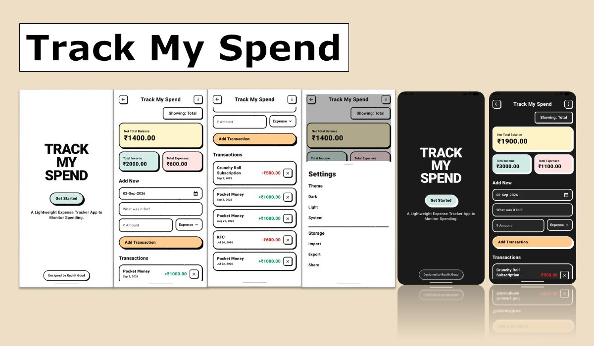

<div align="center">


# TrackMySpend

**A clean, modern expense tracking app for Android, Focuses on simplicity & speed. No accounts, no cloud-just you and your spending.**

</div>

> [!NOTE]
> **Requires Android 12 or later**
>
> 📲 **Easy Install:** No need for a special installer. Just download and install.

---

<div align="center">
  
</div>

---

## ✨ Features

- 💸 **Track Income & Expenses** – Easily record your daily income and spending.
- 📊 **Spending Summary** – View your total balance, income, and expenses at a glance.
- 💾 **Offline Storage** – All your data is securely stored on your device using Room Database.
- 📤 **Import & Export CSV** – Backup or restore your transactions with CSV files.
- 📱 **Share Reports** – Share your transaction reports directly from the app.
- 🎨 **Modern Material 3 UI** – Clean, responsive, and user-friendly interface built with Jetpack Compose.
- 🔒 **Privacy First** – Your data stays on your device and is never uploaded to any server.

---

## 🛠️ Tech Stack

<table align="center">
<tr>
<td align="center" width="180">

<br>
<b>Kotlin</b><br>
Primary Language

</td>

<td align="center" width="180">

<br>
<b>Jetpack Compose</b><br>
Material 3 UI

</td>

<td align="center" width="180">

<br>
<b>Room</b><br>
Local Database

</td>
</tr>

</table>

<p align="center">
    
</p>

---

## 📱 Requirements

   

---

## 📸 Screenshots

<p align="center">
  
  
  
</p>

---

## Installation

[](https://github.com/ruchitgoud/TrackMySpend/releases/latest)


### Install the APK

1. Download the latest APK from the **Releases** page.
2. Locate the downloaded APK in your **Downloads** folder.
3. Tap the APK file to begin installation.
4. If required, allow installation from unknown sources.
5. Tap **Install**.
6. Once installed, Tap **Open** and enjoy using **TrackMySpend**

---

## 🤝 Contributions

Every contribution makes TrackMySpend better!

- 🐛 **Found a bug?** Raise a issue.
- 💡 **Got an idea?** Start a discussion.
- 🔧 **Wanna code?** Fork the repo and submit a PR!
- 📸 **Show it off:** Share a photo of TrackMySpend on your dashboard in the Discussions tab!

---

## ⚠️ Current Issues

- 🚫 **NO Money Currency Change:** Currently only (₹) Indian Rupees is displayed.
- 🤖 **NO AI Summaries:** NO Feedback about your spendings.
- 🗃️ **NO Category or Tags Support:** Cannot sort your spendings.

---

## 🚀 Getting Started

1. Clone the repository:
   ```bash
   git clone https://github.com/ruchitgoud/TrackMySpend.git
   ```
2. Open the project in Android Studio (Ladybug or newer recommended).
3. Build and run on your device or emulator!

---

## 📂 Project Structure

```text
TrackMySpend/
├── 📂 app/               
├── 📂 assets/              
├── 📂 gradle/               
├── 📄 .gitignore
├── 📄 LICENSE
├── 📄 README.md
├── ⚙️ build.gradle.kts
├── ⚙️ settings.gradle.kts
└── ⚙️ gradle.properties
```

---

## 📜 License

This project is licensed under the MIT License - see the [LICENSE](LICENSE) file for details.

---

## 👨‍💻 Author

<p align="left">
  <a href="https://github.com/ruchitgoud">
    
  </a>
</p>
