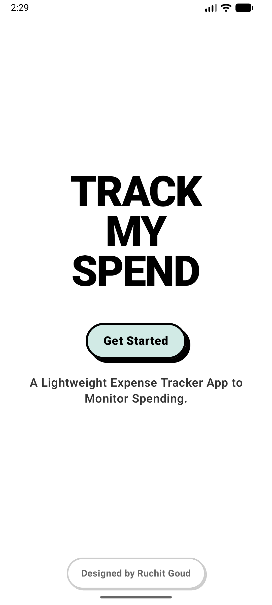
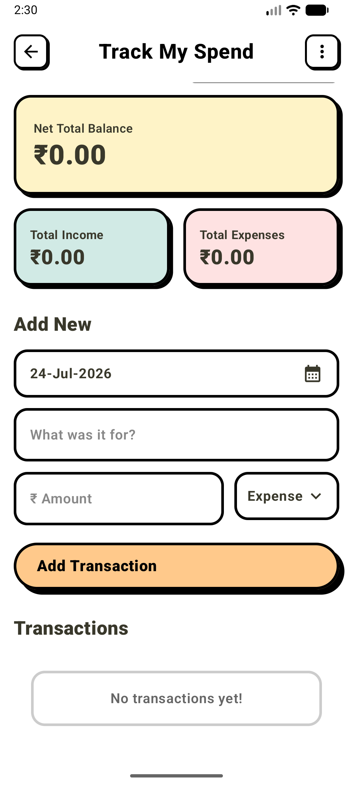
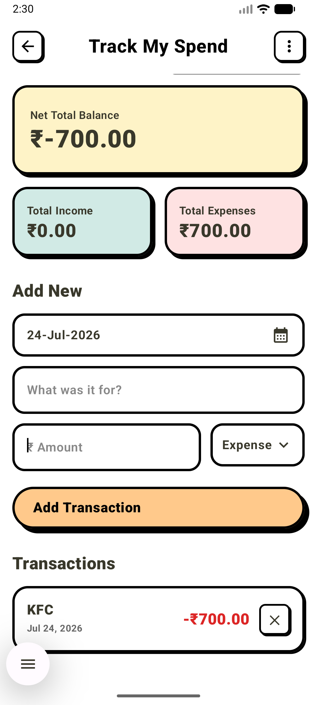

# TrackMySpend 💸

**TrackMySpend** is a high-contrast, Brutalist-styled expense tracker for Android. It focuses on simplicity, speed, and data ownership. No accounts, no cloud—just you and your spending.

## ✨ Features

- **Brutalist UI**: A unique, bold design language featuring high-contrast shadows, thick borders, and vibrant colors.
- **Local-First**: All data is stored securely on your device using a Room database. Your data never leaves your phone.
- **Spending Summary**: Get a quick overview of your income and expenses at a glance.
- **Data Portability**: Import and export your transactions via CSV to keep your data truly yours and easy to backup.
- **Quick Share**: Generate and share CSV reports directly from the app via the system share sheet.

## 📸 Screenshots

| Landing | Tracker | Add Transaction |
| :---: | :---: | :---: |
|  |  |  |

## 🛠️ Tech Stack

- **UI Framework**: [Jetpack Compose](https://developer.android.com/jetpack/compose) (Material 3)
- **Database**: [Room Persistence Library](https://developer.android.com/training/data-storage/room)
- **Architecture**: MVVM (ViewModel, Repository, Flow)
- **Language**: Kotlin
- **Dependency Injection**: Manual / ViewModel Factory

## 📱 Requirements

- **Minimum SDK**: API 23 (Android 6.0)
- **Target SDK**: API 37 (Android 15)

## 🚀 Getting Started

1. Clone the repository:
   ```bash
   git clone https://github.com/ruchitgoud/TrackMySpend.git
   ```
2. Open the project in Android Studio (Ladybug or newer recommended).
3. Build and run on your device or emulator!

## 📜 License

This project is licensed under the MIT License - see the [LICENSE](LICENSE) file for details.

---

## 👤 Author

Built by [Ruchit Goud](https://github.com/ruchitgoud)
